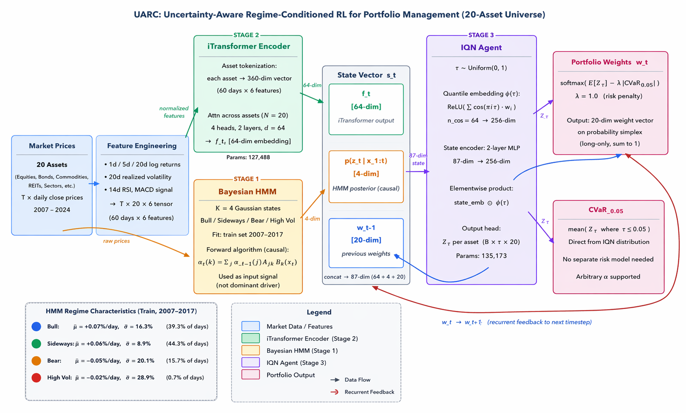

# UARC: Uncertainty-Aware Regime-Conditioned RL for Portfolio Management

A systematic trading research project investigating whether regime-aware reinforcement learning improves portfolio allocation.

---

## Summary

This project evaluates a hybrid architecture combining:

- Bayesian HMM (market regime detection)
- iTransformer (cross-asset representation learning)
- IQN (distributional reinforcement learning)

across a **20-asset diversified portfolio** over a strict **out-of-sample test period (2021–2024)**.

---

## Key Result

Regime conditioning does not improve performance.

All learned agents — regardless of:
- regime signal (none / hard / posterior)
- RL algorithm (DQN vs IQN)

converge to near-identical performance and allocations.

---

## Performance (Test Set: 2021–2024)

System | Sharpe | Ann. Return | Max Drawdown
-------|--------|------------|--------------
Buy & Hold | 0.454 | +4.6% | -22.2%
HMM Hard + DQN | 0.576 | +5.9% | -22.2%
No Regime + IQN | 0.576 | +5.9% | -22.2%
HMM Posterior + DQN | 0.576 | +5.9% | -22.2%
UARC (Ours) | 0.576 | +5.9% | -22.2%

---

## Interpretation

- Representation learning dominates: the encoder implicitly captures regime structure  
- Distributional RL stabilizes training but does not change allocations  
- Policies collapse to diversified, near-equal-weight portfolios  

---

## Architecture

State = Embedding (64) + Posterior (3) + Previous Weights (20) → IQN Agent → Portfolio Weights

---

## Experimental Setup

- Assets: 20 (equities, bonds, commodities, defensive)
- Frequency: Daily
- Train: 2000–2017
- Validation: 2018–2020
- Test: 2021–2024 (strict holdout)

No lookahead. No parameter updates during testing.

---

## Pipeline

python run_stage1.py  
python run_stage2.py  
python run_stage3.py --seeds 42  
python run_stage4.py  

---

## Diagnostics

- L1 distance to equal weight ≈ 0  
- Portfolio entropy ≈ maximum  
- Turnover ≈ 0  

---

## Limitations

- Replay buffer does not store raw encoder inputs  
- Linear transaction cost model  
- Fixed asset universe  

---

## Future Work

- Fix encoder–replay mismatch  
- Scale to larger universes  
- Adaptive risk aversion  
- Regime-conditioned hedging  

---

## Reproducibility

pytest tests/

Outputs:
outputs/backtest_results.csv  
outputs/figures/

---

## License

MIT